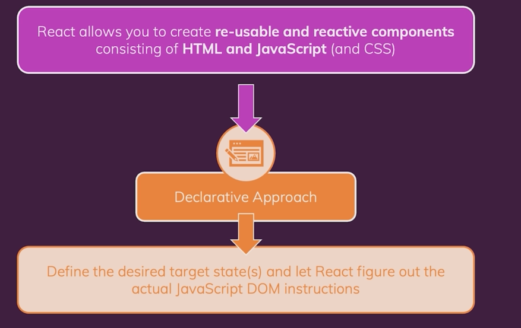
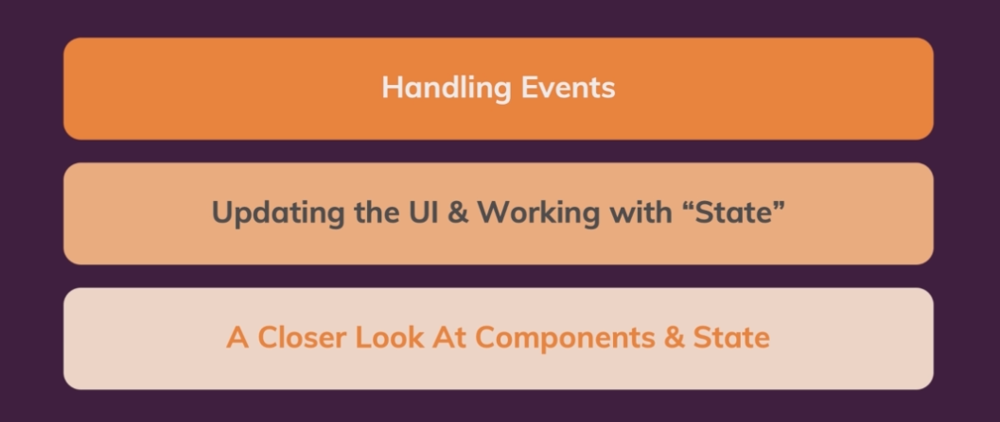

## Module 3 - Recact State and Working with Events

---

### Lecture 1: Module Introduction

---

#### React & Components

- In the last module we only created static apps but in this module we want to build some interactive apps.
  We will cover the following contents in this module.

---

### lecture 2: Listening to Events & Working with Event Handlers

---

- On all built-in HTML elements we have full access to all native DOM events. You can find information about DOM events that an element supports in MDN site.

- If and element supports and event, then you can add a listener: on + event name prop (start with capital leter).

- Event handler function naming convention: event name + Handlder.

- Change the code somehow that by clicking a button it prints "Clicked!" on the console?

---

### Lecture 3: How Component Functions Are Executed

---

-Your component is just a regular function. Whenever react evaluates this JSX code, it will call this component function and it continues untill there is no JSX code to be evaluated. It starts with index.js
where we initially point at the app component.

- The above process just happens once. We should say react that certain component must be re-evaluated.

---

### Lecture 4: Working With State

---

- Extract specifically named things from react library => `import React, {useState} from 'react'` (a function provided by react library and this function allows us to define values as state when changes to this values should reflect in the component function being called again).

- `useState()` is called react hook:

  1. Hooks are recognized with the starting word "use".
  2. Hooks must be called **_directly_** inside react component functions.

- put `const [title, setTitle] = useState(props.title)` at the begining of component function.

- Inside clikHandler function put `setTitle('Updated')` => the component function will be executed again when our state changes.

- State updating function doesn't change the value right away but instead schedules this state update.

---

### lecture 5: A Closer Look at te `useState` hook

---

- `useState` register some states for the component in which it is being called.

- The component function is called four times and every time it is called a new separate state is created and managed independently by react.

- React manages states for us so we use `const [title, setTitle]` and there is no need to use `let`. for the first time react use `props.title` in `useState(props.title)` for initialization and afterwards it doesn't use it.

---

### lecture 7: Adding From Inputs

---

- To emphasize that JSX under the hood uses react library we import react library, but it is not necessary.
